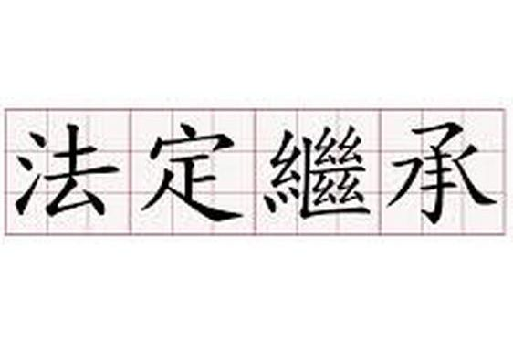



`继承`是java面向对象编程技术的一块基石，因为它允许创建分等级层次的类。

`继承`就是子类继承父类的特征和行为，使得子类对象（实例）具有父类的实例域和方法，或子类从父类继承方法，使得子类具有父类相同的行为。




- 关键字extends表明正在构造的新类派生于一个已存在的类。

- 已存在的类称为超类、基类或父类，新类称为子类、派生类或者孩子类

- super的用法
  <code>code</code>

  ```java
  super.getSalary()	// 调用方法
  super(n, s, year, month, day)	// 调用构造方法
  ```

  <!-- more -->

- 当子类没有显式调用父类构造器时

  - 自动地调用超类（默认没有参数）
  - 如果超类没有不带参数的构造器，Java编译器将报告错误

- Java中使用super调用超类的方法，而在C++中则采用超类名加上::操作符的形式。例如，在Manager类的getSalary方法中，应该将super.getSalary替换为Employee::getSalary

- 由一个公共超类派生出来的所有类的集合被称为继承层次，从某个特定的类到其祖先的路径被称为该类的继承链

- Java不支持多继承

- 多态

  - 多态是同一个行为具有多的不同表现形式或形态的能力

  - 多态就是同一个接口，使用不同的实例而执行不同操作

  - 在此处讲一下C++中的虚函数

    - C++的多态是通过虚函数来实现的，在C++中，方法被virtual修饰的话，该方法为虚函数，可以被子类覆盖

    - 纯虚函数在基类中没有定义，但要求任何派生类都要定义实现自己的方法，在基类中实现纯虚函数的方法是在函数原型后加“=0”

    - 类中至少有一个函数被声明为纯虚函数，则这个类就是抽象类，所以一个抽象类是可以有纯虚函数与虚函数与非虚函数的

    - 如果子类没有重写纯虚函数，就尝试实例化该函数的话，会导致编译错误

    - 下面的代码是通过地址来调用方法的，没接触过的，耐心点看，也看得懂的啦

      ```c++
      #include<iostream>
      using namespace std;
       
      class A {
      public:
      	virtual void vfunc1() { cout << "A::vfunc1()" << endl; };
      	virtual void vfunc2() { cout << "A::vfunc2()" << endl; };
      	void func1() { cout << "A::func1()" << endl; };
      	void func2() { cout << "A::func2()" << endl; };
      private:
      	int data1_;
      	int data2_;
      };
       
      class B :public A {
      public:
      	virtual void vfunc1() override { cout << "B::vfunc1()" << endl; };
      	void func2() { cout << "B::func2()" << endl; };
      private:
      	int data3_;
      };
       
      class C :public B {
      public:
      	virtual void vfunc1() override { cout << "C::vfunc1()" << endl; };
      	void func2() { cout << "C::func2()" << endl; };
      private:
      	int data1_, data4_;
      };
       
      //演示了手动调用虚函数的过程
      int main() {
      	B a;
      	typedef void(*Fun)(void);
      	Fun pFun = nullptr;
      	cout << "虚函数表地址：" << (int*)(&a) << endl;
      	cout << "虚函数表第1个函数地址："<<(int*)*(int*)(&a) << endl;
      	cout << "虚函数表第2个函数地址：" << (int*)*(int*)(&a) + 1 << endl;
      	pFun = (Fun)*((int*)*(int*)(&a));
      	pFun();
      	pFun = (Fun)*((int*)*(int*)(&a) + 1);
      	pFun();
      	return 0;
      }
      ————————————————
      版权声明：本文为CSDN博主「i_chaoren」的原创文章，遵循 CC 4.0 BY-SA 版权协议，转载请附上原文出处链接及本声明。
      原文链接：https://blog.csdn.net/i_chaoren/article/details/77281785
      ```

    - 所以，其实，Java中不存在虚函数（压根没有virtual修饰符），但其实在方法中已经默认用了虚函数这个概念，所以不需要修饰符，即可通过@Override实现重写，直接撰写重载后的同名构造方法，直接通过父类实现不同的接口，得到不同的对象

    - 所以，多态的概念派生出了了覆盖（重载和重写）和重载（同名函数）

    - 但其实说来说去，有了继承才有多态，所以说继承和多态可以说成一个概念，也不是不行

    - 所以，面向对象的基本特征就是两个：封装和继承（继承包括多态），你也可以说三个：封装、继承和多态

    - 为什么我会有这个疑问呢，附上链接 
      https://blog.csdn.net/baidu_33714003/article/details/52290627
  
- 虚拟机中的方法的动态绑定
  
    - emmm 暂时不写 留着 留个坑
  
- final类和final方法
  
    - 阻止继承，若希望阻止某类定义子类，则使用final修饰符声明
      
        ```java
        public final class Executive extends Manager
        ```
        
    - final类下的所有方法自动地变成了final方法，final修饰的方法无法被覆盖（重载或重写）
    
- 父子类的强制类型转换
  - 只能在继承层次内进行类型转换
    
      - 在将超类转换成子类之前，应该使用instanceof进行检查
      
        ```java
        if (staff[1] instanceof Manager) {
        	boss = (Manager) staff[1]
        }
        ```
      
      - Instanceof运算符是用来运行时指出对象是否是特定类的一个实例
      
        ```java
        result = object instanceof class
        ```
      
      - 如果要进行强制类型转换，一般说明你的父类设计的有问题
  
- 抽象类
  - 被abstract修饰的方法叫抽象方法，抽象方法不需要被实现
    
    - 包含一个或多个抽象方法的类本身必须被声明为抽象的，称为抽象类
      
    - Java中的抽象类与C++中的抽象类一样，都允许包含具体数据与具体方法
      
    - 抽象方法充当着占位的角色
      
    - 扩展抽象类有两种选择
      
      - 在抽象类 中定义部分抽象类方法或不定义抽象类方法，这种情况下，子类也需标记为抽象类
      - 在抽象类中定义全部的抽象方法，这种情况下，子类就不需要是抽象的了
      
    - 类即使不含抽象方法，也可以将类声明为抽象类
      
    - 抽象类不能被实例化，但是可以被定义
      
        ```javascript
        Person p = new Student("hhha"); // Person是抽象类，Student是Person的子类
        ```
  
- Object类：所有类的超类
  
    - 可以使用Object类型的变量引用任何类型的对象：
      
        ```Java
        Object obj = new Employee("Harry Hacker", 35000);
        ```
      
    - 在Java中，只有基本数据类型不是对象
    
- equals方法
  
    - 用于检测一个对象与另一个对象是否具有相同的引用
    - Java语言规范要求equals方法具有下面的特性：
      - 自反性：对于任何非空引用x，x.equals(x)应返回true
      - 对称性：对于任何引用x和y，当且仅当y.equals(x)返回true，x.equals(y)也应该返回true
      - 传递性：对于任何引用x、y和z，如果x.equals(y)返回true，y.equals(z)返回true，x.equals(z)也应该返回true
      - 一致性：如果x和y引用的对象没有发生变化，反复调用x.equals(y)应该返回同样的结果
      - 对于任意非空引用x，x.equals(null)应该返回false
    - hashCode方法
      - 若重新定义了equals方法，就必须重新定义hashCode方法，以便用户可以将对象插入到散列表中
      - 如果x.equals(y)返回true，那么x.hashCode()就必须等于y.hashCode()具有相同的值，需要根据equals的定义来定义hashCode方法
      
    
- toString方法

    - 用于返回表示对象值的字符串

- 泛型数组列表

    - Java中，允许在运行时确定数组的大小

        ```java
        int actualSize = . . .;
        Employee[] staff = new Employee[actualSizxe];
        ```

    - 当然，这段代码并没有完全解决运行时动态更改数组的问题。一旦首次确定了数组的大小，就没那么容易改变数组的大小了，是一种假动态

    - 要用就用ArrayList

- 类型化与原始数组列表的兼容性

    - jdk5之前，还没有泛型，存在着原始遗留代码

    - 下面看一些没有使用类型参数的代码

        ```java
        public class EmployeeDB{
        	public void update(ArrayList list)	{. . .}	// ArrayList没有指定类型参数
        	public ArrayList find(String query)	{. . .}	// 同上
        }
        ArrayList<Employee> staff = . . .;
        employeeDB.update(staff);	// 这样子是不会报错的
        ```

    - 尽管编译器不会报错，但如果添加进去的数组元素不是Employee类型，这就麻烦咯

    - 相反地，将一个原始的ArrayList赋给一个类型化ArrayList会得到一个警告

        ```java
        ArrayList<Employee> result = employeeDB.find(query);	// yields warning
        ```

    - 使用类型转换的时候，避免不了警告

    - 一旦能确保不会造成严重的后果，可以使用@SuperessWarnings("unchecked")标注来标记这个变量能够接受类型转换

- 对象包装器与自动装箱

    - 所有的基本类型都有一个与之对应的类，这些类称为包装器
    - int与Integer会自动变换，这种变换称为自动装箱与自动拆箱

- 参数可变的方法

    ```java
    public PrintStream printf(String fmt, Object... args)
    ```

    - …表明这份方法可以接受任意数量的对象，用数组的方式访问

- 反射

    - 反射库提供了一个非常丰富且精心设计的工具集，以便编写能够动态操纵java代码的程序
    - 能够分析类能力的程序称为反射，反射机制可以用来：
        - 在运行时分析类的能力
        - 在运行时查看对象，例如，编写一个toString方法供所有使用
        - 实现通用的数组操作代码
        - 利用Method对象，这个 对象很像C++中的函数指针

- Class类

    - Java运行时，系统始终为所有的对象维护一个被称为运行时的类型标识，这个信息跟踪着每个对象所属的类。虚拟机利用运行时类型信息选择相应的方法执行。
    - 保存这些信息的类被称为Class，Object类中的getClass()方法将会返回一个Class类型的实例
    - Class对象实际上表示的是一种类型，而这个类型未必一定是一种类。例如，int不是类，int.class是一个Class类型的对象
    - 可以利用==运算符实现两个类对象比较操作
    
- 捕获异常

    - 异常分为：未检查异常和已检查异常
    - 对于已检查代码，编译器将会检查是否提供了处理器。try catch就是常见的捕获异常
    - 未检查代码，编译器会直接抛出异常，例如null引用，是属于未检查异常
    - 所有异常若未处理，编译器就会给出错误报告

- 

