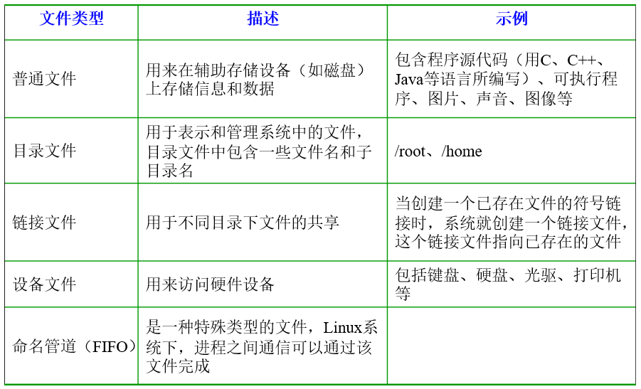
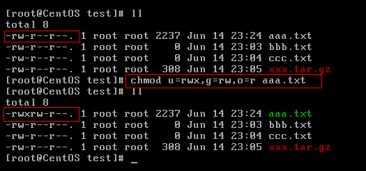
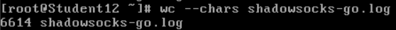
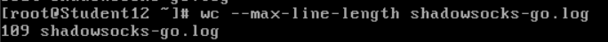
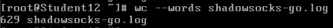
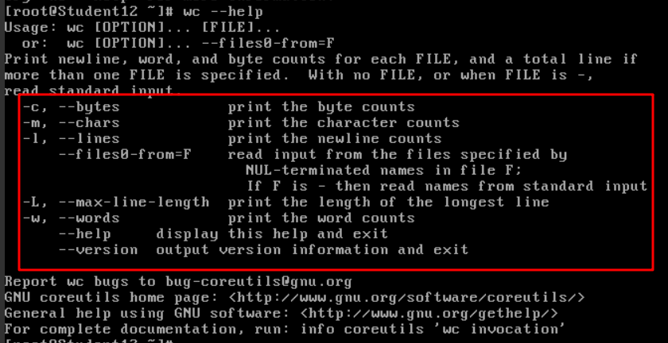
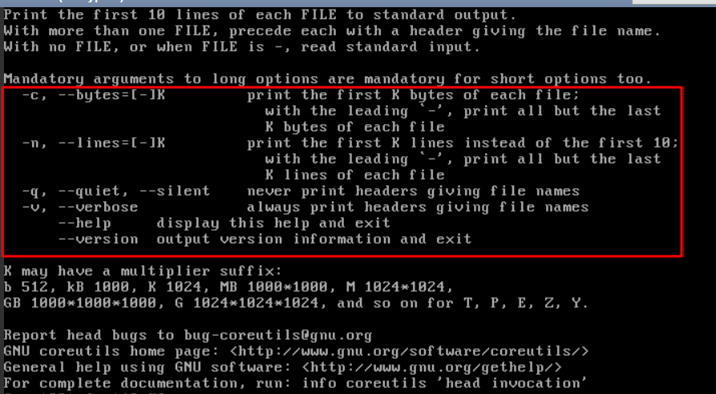
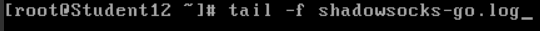
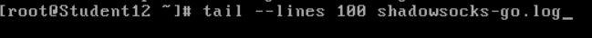
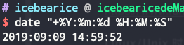

部分转载自: JavaGuide开源项目 [Github-后端程序员必备的Linux基础](https://snailclimb.gitee.io/javaguide/#/operating-system/%E5%90%8E%E7%AB%AF%E7%A8%8B%E5%BA%8F%E5%91%98%E5%BF%85%E5%A4%87%E7%9A%84Linux%E5%9F%BA%E7%A1%80%E7%9F%A5%E8%AF%86?id=%E5%9B%9B-linux%E5%9F%BA%E6%9C%AC%E5%91%BD%E4%BB%A4)

### Linux支持的5种文件类型

普通文件 目录文件 链接文件 设备文件 命名管道FIFO



关于链接的种类有: 硬链接和软连接 可点击跳转 查看 [Linux硬链接与软连接](<https://icebearice.gitee.io/2019/05/06/Linux/Linux硬链接和软链接>)

### 目录切换命令

- **cd usr：** 切换到该目录下usr目录
- **cd ..（或cd../）：** 切换到上一层目录
- **cd /：** 切换到系统根目录
- **cd ~：** 切换到用户主目录
- **cd -：** 切换到上一个操作所在目录

### 目录的操作命令

1. **mkdir 目录名称：** 增加目录

2. **ls或者ll**（ll是ls -l的别名，ll命令可以看到该目录下的所有目录和文件的详细信息）：查看目录信息

3. **find 目录 参数：** 寻找目录（查）

   示例：

   - 列出当前目录及子目录下所有文件和文件夹: `find .`
   - 在`/home`目录下查找以.txt结尾的文件名:`find /home -name "*.txt"`
   - 同上，但忽略大小写: `find /home -iname "*.txt"`
   - 当前目录及子目录下查找所有以.txt和.pdf结尾的文件:`find . \( -name "*.txt" -o -name "*.pdf" \)`或`find . -name "*.txt" -o -name "*.pdf"`

4. **mv 目录名称 新目录名称：** 修改目录的名称（改）

   注意：mv的语法不仅可以对目录进行重命名而且也可以对各种文件，压缩包等进行 重命名的操作。mv命令用来对文件或目录重新命名，或者将文件从一个目录移到另一个目录中。后面会介绍到mv命令的另一个用法。

5. **mv 目录名称 目录的新位置：** 移动目录的位置---剪切（改）

   注意：mv语法不仅可以对目录进行剪切操作，对文件和压缩包等都可执行剪切操作。另外mv与cp的结果不同，mv好像文件“搬家”，文件个数并未增加。而cp对文件进行复制，文件个数增加了。

6. **cp -r 目录名称 目录拷贝的目标位置：** 拷贝目录（改），-r代表递归拷贝

   注意：cp命令不仅可以拷贝目录还可以拷贝文件，压缩包等，拷贝文件和压缩包时不 用写-r递归

7. **rm [-rf] 目录:** 删除目录（删）

   注意：rm不仅可以删除目录，也可以删除其他文件或压缩包，为了增强大家的记忆， 无论删除任何目录或文件，都直接使用`rm -rf` 目录/文件/压缩包

### 文件的操作命令

1. **touch 文件名称:** 文件的创建（增）

2. **cat/more/less/tail 文件名称** 文件的查看（查）

   - **cat：** 查看显示文件内容
   - **more：** 可以显示百分比，回车可以向下一行， 空格可以向下一页，q可以退出查看
   - **less：** 可以使用键盘上的PgUp和PgDn向上 和向下翻页，q结束查看
   - **tail-10 ：** 查看文件的后10行，Ctrl+C结束

   注意：命令 tail -f 文件 可以对某个文件进行动态监控，例如tomcat的日志文件， 会随着程序的运行，日志会变化，可以使用tail -f catalina-2016-11-11.log 监控 文 件的变化

3. **vim 文件：** 修改文件的内容（改）

   vim编辑器是Linux中的强大组件，是vi编辑器的加强版，vim编辑器的命令和快捷方式有很多，但此处不一一阐述，大家也无需研究的很透彻，使用vim编辑修改文件的方式基本会使用就可以了。

   **在实际开发中，使用vim编辑器主要作用就是修改配置文件，下面是一般步骤：**

   vim 文件------>进入文件----->命令模式------>按i进入编辑模式----->编辑文件 ------->按Esc进入底行模式----->输入：wq/q! （输入wq代表写入内容并退出，即保存；输入q!代表强制退出不保存。）

4. **rm -rf 文件：** 删除文件（删）

   同目录删除：熟记 `rm -rf` 文件 即可

### 压缩文件的操作命令

**1）打包并压缩文件：**

Linux中的打包文件一般是以.tar结尾的，压缩的命令一般是以.gz结尾的。

而一般情况下打包和压缩是一起进行的，打包并压缩后的文件的后缀名一般.tar.gz。 命令：**tar -zcvf 打包压缩后的文件名 要打包压缩的文件** 其中：

z：调用gzip压缩命令进行压缩

c：打包文件

v：显示运行过程

f：指定文件名

比如：加入test目录下有三个文件分别是：aaa.txt bbb.txt ccc.txt，如果我们要打包test目录并指定压缩后的压缩包名称为test.tar.gz可以使用命令：**tar -zcvf test.tar.gz aaa.txt bbb.txt ccc.txt或：tar -zcvf test.tar.gz       /test/**

**2）解压压缩包：**

命令：tar [-xvf] 压缩文件

其中：x：代表解压

示例：

1 将/test下的test.tar.gz解压到当前目录下可以使用命令：**tar -xvf test.tar.gz**

2 将/test下的test.tar.gz解压到根目录/usr下:**tar -xvf xxx.tar.gz -C /usr**（- C代表指定解压的位置）

### Linux的权限命令

操作系统中每个文件都拥有特定的权限、所属用户和所属组。权限是操作系统用来限制资源访问的机制，在Linux中权限一般分为读(readable)、写(writable)和执行(excutable)，分为三组。分别对应文件的属主(owner)，属组(group)和其他用户(other)，通过这样的机制来限制哪些用户、哪些组可以对特定的文件进行什么样的操作。通过 **ls -l** 命令我们可以 查看某个目录下的文件或目录的权限

示例：在随意某个目录下`ls -l`


第一列的内容的信息解释如下：


> 下面将详细讲解文件的类型、Linux中权限以及文件有所有者、所在组、其它组具体是什么？

**文件的类型：**

- d： 代表目录
- -： 代表文件
- l： 代表软链接（可以认为是window中的快捷方式）

**Linux中权限分为以下几种：**

- r：代表权限是可读，r也可以用数字4表示
- w：代表权限是可写，w也可以用数字2表示
- x：代表权限是可执行，x也可以用数字1表示

**文件和目录权限的区别：**

对文件和目录而言，读写执行表示不同的意义。

对于文件：

| 权限名称 | 可执行操作                |
| -------- | ------------------------- |
| r        | 可以使用cat查看文件的内容 |
| w        | 可以修改文件的内容        |
| x        | 可以将其运行为二进制文件  |

对于目录：

| 权限名称 | 可执行操作               |
| -------- | ------------------------ |
| r        | 可以查看目录下列表       |
| w        | 可以创建和删除目录下文件 |
| x        | 可以使用cd进入目录       |

**需要注意的是超级用户可以无视普通用户的权限，即使文件目录权限是000，依旧可以访问。** **在linux中的每个用户必须属于一个组，不能独立于组外。在linux中每个文件有所有者、所在组、其它组的概念。**

- **所有者**

  一般为文件的创建者，谁创建了该文件，就天然的成为该文件的所有者，用ls ‐ahl命令可以看到文件的所有者 也可以使用chown 用户名 文件名来修改文件的所有者 。

- **文件所在组**

  当某个用户创建了一个文件后，这个文件的所在组就是该用户所在的组 用ls ‐ahl命令可以看到文件的所有组 也可以使用chgrp 组名 文件名来修改文件所在的组。

- **其它组**

  除开文件的所有者和所在组的用户外，系统的其它用户都是文件的其它组

> 我们再来看看如何修改文件/目录的权限。

**修改文件/目录的权限的命令：chmod**

示例：修改/test下的aaa.txt的权限为属主有全部权限，属主所在的组有读写权限， 其他用户只有读的权限

**chmod u=rwx,g=rw,o=r aaa.txt**



上述示例还可以使用数字表示：

chmod 764 aaa.txt

**补充一个比较常用的东西:**

假如我们装了一个zookeeper，我们每次开机到要求其自动启动该怎么办？

1. 新建一个脚本zookeeper
2. 为新建的脚本zookeeper添加可执行权限，命令是:`chmod +x zookeeper`
3. 把zookeeper这个脚本添加到开机启动项里面，命令是：`chkconfig --add  zookeeper`
4. 如果想看看是否添加成功，命令是：`chkconfig --list`

### 跨机器文件的相互拷贝

从192.0.0.101的temp/下 复制var下的所有文件  到本地的test目录下

```
# scp root@192.0.0.101:/temp/var/* /test/
```

将本地temp/var/下的所有文件 复制到192.0.0.101的test目录下

```
# scp /temp/var/* root@192.0.0.102:/test/
```

### Vim编辑器下的常用命令

跳转至指定25行 25G

### 查看负载的三种方式

[Linux查看负载的三种方式](https://icebearice.gitee.io/2019/05/06/Linux/Linux查看负载的三种方式)

### 查看文件的相关指令

#### Word Count 工具命令大全

查看指定文件的行数 wc -l(或者--lines) file.log


查看指定文件的字节数 wc -c(或者--bytes) file.log


查看指定文件的字符数 wc -m(或者 --chars) file.log



查看指定文件的最长行的长度 wc -L(或者 --max-line-length) file.log



查看指定文件的总字数 wc -w(或者 --words) file.log



查看帮助 wc --help



#### 查看档案(文件)内容的相关行数命令

##### head命令 从头查询(前n个XXX)的命令

查看指定文件的前n个字节内容 head -c(或者 --bytes) 100 file.log


查看指定文件的前n行的内容 head -l(或者 --lines) 100 file.log


查看帮助 head --help




##### tail命令 从尾查询(后n个XXX)的命令

**(重点重点!!!!)动态加载指定文件的内容**(当文件增长时, 输出后续添加的数据) 

tail -f(或者--follow) file.log 

(一般会用tail -f catalina.log 查看tomcat的日志) 




退出按Ctrl+Z或者Ctrl+C Ctrl+Z会挂起当前tail进程 **后面有关于退出指令的区别描述**

查看指定文件的后n个字节 tail -c(或者 --bytes) 100 file.log


查看指定文件的后n行 tail -n(或者 --lines) 100 file.log



查看帮助 tail --help

查看版本号 tail --version


### Linux Ctrl+C Ctrl+Z Ctrl+D的区别

**ctrl-c:** ( kill foreground process ) 发送 SIGINT 信号给前台进程组中的所有进程，强制终止程序的执行；

**ctrl-z:** ( suspend foreground process ) 发送 SIGTSTP 信号给前台进程组中的所有进程，常用于挂起一个进程，而并非结束进程，用户可以使用使用**fg/bg**操作恢复执行前台或后台的进程。

**fg** 命令在前台恢复执行被挂起的进程，此时可以使用ctrl-z再次挂起该进程，**bg **命令在后台恢复执行被挂起的进程，而此时将无法使用ctrl-z再次挂起该进程；

一个比较常用的功能：

**正在使用vi编辑一个文件时，需要执行shell命令查询一些需要的信息，可以使用ctrl-z挂起vi，等执行完shell命令后再使用fg恢复vi继续编辑你的文件（当然，也可以在vi中使用！command方式执行shell命令但是没有该方法方便）**

**ctrl-d:** ( Terminate input, or exit shell ) 一个特殊的二进制值，表示 EOF，作用相当于在终端中输入exit后回车；

### Linux Grep 正则表达式的使用

#### pattern正则表达式主要参数：

\： 忽略正则表达式中特殊字符的原有含义。(转义)
^：匹配正则表达式的开始行。
$: 匹配正则表达式的结束行。
\<：从匹配正则表达式的行开始。
\>：到匹配正则表达式的行结束。
[ ]：单个字符，如[A]即A符合要求 。
[ - ]：范围，如[A-Z]，即A、B、C一直到Z都符合要求 。
。：所有的单个字符。
\* ：有字符，长度可以为0。

#### grep命令使用简单实例

**$ grep ‘test’ d***
显示所有以d开头的文件中包含 test的行。
**$ grep ‘test’ aa bb cc**
显示在aa，bb，cc文件中匹配test的行。
**$ grep ‘[a-z]\{5\}’ aa**
显示所有包含每个字符串至少有5个连续小写字符的字符串的行。
**$ grep ‘w\(es\)t.*\1′ aa**
如果west被匹配，则es就被存储到内存中，并标记为1，然后搜索任意个字符(.*)，这些字符后面紧跟着 另外一个es(\1)，找到就显示该行。如果用egrep或grep -E，就不用”\”号进行转义，直接写成’w(es)t.*\1′就可以了。

##### 贴上Java正则表达式的捕获组 有兴趣的自行食用

捕获组分为 普通捕获组和命名捕获组

<https://www.runoob.com/w3cnote/java-capture-group.html>

##### Linux/Unix 时间输出妙用



<code>date "+%Y-%m-%d %H:%M:%S"</code>，即可输出对应格式时间



参考链接：https://blog.csdn.net/jk110333/article/details/8590746

