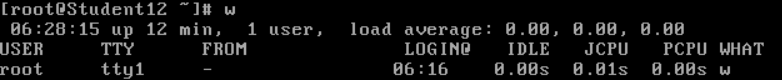

转载自: https://www.cnblogs.com/zhaozhenguo666/p/5512701.html

**1 uptime 显示当前机器的负载情况**

**2 w 显示当前机器的负载情况, 并列出所有user分别的负载情况**

load average: 过去1分钟 5分钟 15分钟的负载平均值

**以上两个命令为单纯的反映出负载, 还有更为使用的查看服务器负载的命令**

**3 top 实时监控当前的服务器负载情况, 清晰的罗列出每一个进程占有的cpu使用和内存使用**, 输入q退出

Tasks: 目前的进程总数, 以及所处状态, running表示可运行进程, sleeping表示暂停进程, stopped表示停止运行, zombie表示僵尸进程, 若zombie不为0则表示进程出现问题

Cpu(s): 展示了当前CPU的状态，us表示用户进程占用CPU比例，sy表示内核进程占用CPU比例，id表示空闲CPU百分比，wa表示IO等待所占用的CPU时间的百分比。**wa占用超过30%则表示IO压力很大**。

Mem: [展示了当前内存的状态，total是总的内存大小，userd是已使用的，free是剩余的，buffers是目录缓存。

Swap: 同Mem行，cached表示缓存，用户已打开的文件。**如果Swap的used很高，则表示系统内存不足**。

**按1, 可以展示出服务器有多少CPU, 以及每个CPU的使用情况**

在top命令下，按**shift + "c"**，则将进程按照CPU使用率从大到小排序，按shift+"p"，则将进程按照内存使用率从大到小排序，很容易能够定位出哪些服务占用了较高的CPU和内存。

**仅仅有top命令是不够的**，因为它仅能展示CPU和内存的使用情况，对于负载升高的另一重要原因——**IO没有清晰明确的展示**。linux提供了**iostat**命令，可以了解io的开销。

输入**iostat -x 1 10**命令，表示开始**监控输入输出状态**，**-x表示显示所有参数信息**，**1表示每隔1秒监控一次，10表示共监控10次**。

没有iostat命令的话  yum/apt-get install sysstat -y 即可

其中rsec/s表示读入，wsec/s表示每秒写入，这两个参数某一个特别高的时候就表示磁盘IO有很大压力，util表示IO使用率，如果接近100%，说明IO满负荷运转。 