> 用VMware Workstation装的虚拟机, 具体安装过程请自行百度啦, 搜索关键字CentOS对应版本的安装 就出来啦.
>
> 来公司的第一件事, 老大叫我配个Go环境的虚拟机, 虚拟机的安装倒是跟着教程一步步的弄好了, 想要用SecureCRT连接本地虚拟机, 总不能用VMware Workstation自带的界面吧, 人家毕竟是专门做虚拟机的, 又不是专门做Shell工具的
>
> 常见的Shell工具有Xshell和SecureCRT两种啦, SecureCRT有自带的文件传输功能, XShell想要传文件可能需要另一个产品叫XFTP, XFTP的远程文件系统就比SecureCRT的功能要多一些了, 如果只是有上传文件和下载文件功能的需求 又不想装多一个东西的话, 用SecureCRT自带的sz和rz命令就可以啦, 如果需要在图形界面远程浏览虚拟机的文件系统, 就下XFTP吧

**上面都是废话, 下面才是主要内容**

### 虚拟机环境

VMware Workstation 10 + CentOS 6.8 + Windows10

### 连接工具

SecureCRT或者XShell 这里用的是SecureCRT

### 连接前提

1. 虚拟机和远程终端工具
2. 配置静态IP, 免得每次连接的时候都要查看IP, 如果没有设置静态IP的话, IP会随着你每次联网而不断变更的(下文会讲解如何配置静态IP)
3. 虚拟机连接模式为NAT模式

### 如何配置虚拟机的静态IP

1. 查看网卡IP名 cd /etc/sysconfig/network-scripts/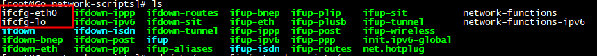

   ifcfg-eth开头的就都是你的网卡IP名啦, 你可能有多个, 没关系, 挑一个来用就行了

2. 编辑网卡文件 vim ifcfg-eth0

3. 确认ONBOOT项为yes, 将IPADDR NETMASK GATEWAK DNS1改为对应项(见下文)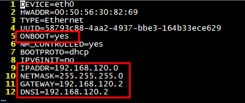

4. 打开VMware Workstation 选择菜单 编辑-虚拟网络编辑器

5. 如果信息框都是灰的, 没关系, 点击更改设置 赋予管理员权限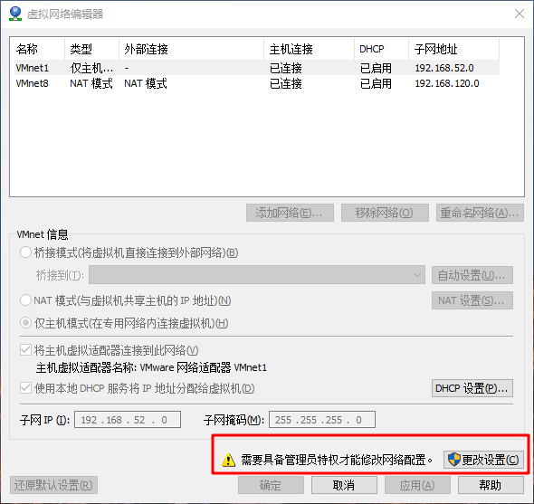

6. 选择VMnet8 修改其子网 网段随意 子网掩码192的是24位 即 255.255.255.0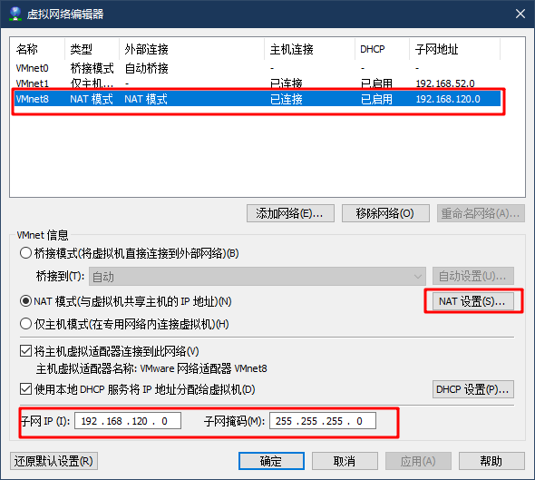

7. 设置完后, 点击NAT设置, 修改网关入口, 修改完后确定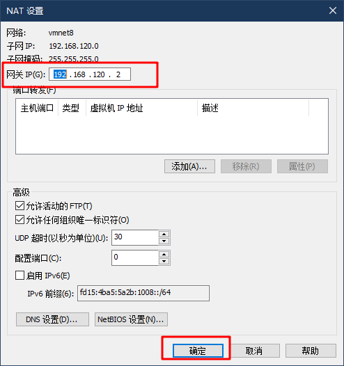

8. 再次点击确定, 需要等一会, 因为他在修改你的网卡设置

9. 按道理来说, 目前所有的步骤设置完之后, 是没有问题的, 保险起见, 我们去适配器设置看看VMnet8网卡配置是否正确

10. 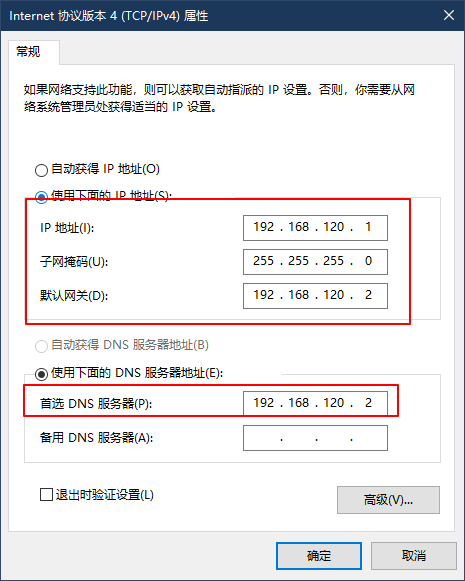

11. 没问题之后, 将上面那个配置文件的IP 掩码和网关都配置好 dns配不配应该是没关系的

12. 配置完后, 保存退出, 输入命令 service network restart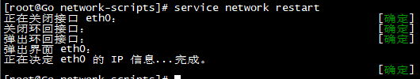

13. 如果都是绿色的话 就没问题啦 如果有红色 配置肯定有问题的 可打ifconfig查看一下ip配置情况 有eth0的网卡配置就说明没问题啦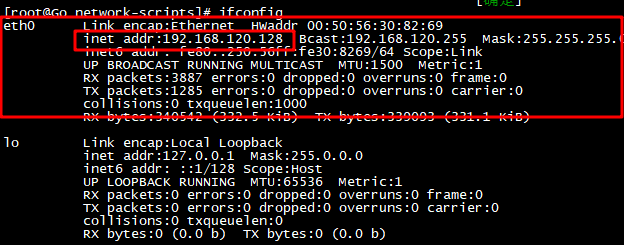

14. 通过ifconfig获取的ip 地址 192.168.120.128(你有你的IP地址 自己查) 就可以用来远程连接了

15. 打开SecureCRT或者XShell 建立新的连接 输入ip地址 并且输入用户名root或者你自己的用户名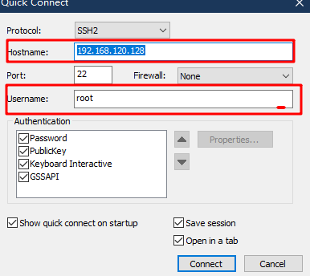

16. 连接成功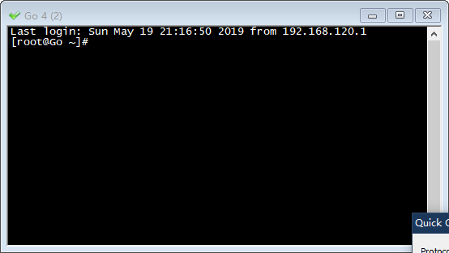

### 迁移了虚拟机 无法联网 怎么处理

1. 在关闭虚拟机的情况下, 右键虚拟机-设置-网络适配器-高级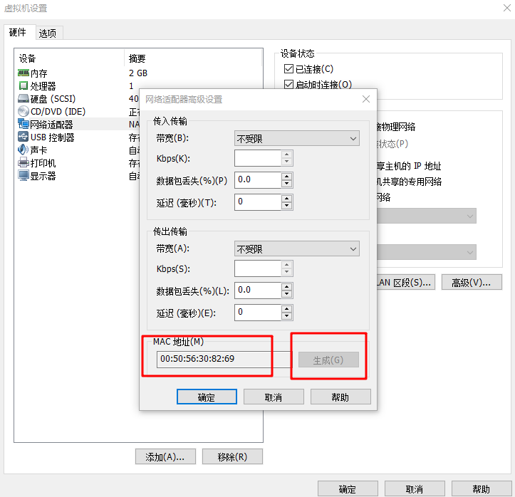
2. 未关闭虚拟机的的情况下, 生成键是不可选的, 需关闭虚拟机才可以点击, 关闭后点击生成, 会生成mac地址
3. 修改 ifcfg-eth0文件的HWADDR hardware地址 硬件地址即物理地址 修改为生成的mac地址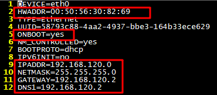
4. 修改后, 重启网络 service network restart 应该是不行的, 会显示失败
5. 重启虚拟机即可解决