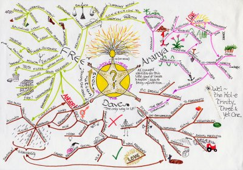

### 思维导图-知识整理	百度脑图		    自用

#### 前端：

#### [HTML](http://naotu.baidu.com/file/951ec7faee21af0d7b94ee824ddcbe19?token=d7db50ae11959597)	[Css](http://naotu.baidu.com/file/ca0c4759841da2ee53eca123a7900046?token=1750141306459a4d)		[JQuery](http://naotu.baidu.com/file/5564b57ad317c91b61ea8197f4a9c4aa?token=5ea6ebc9e64043ec)		[JSP](http://naotu.baidu.com/file/5949e7899962d777a62ce69ed8527d42?token=c0785ee7518e95b0)		[Ajax](http://naotu.baidu.com/file/b2f3571fadcd5c68ffa41c1e7063014c?token=b8a16e593fbea2c0)		[EL表达式](http://naotu.baidu.com/file/c12f3110c0a38fb0fd0fff1c41e2a4a0?token=5cd23d2a080cdd92)		[JSTL](http://naotu.baidu.com/file/cb32d73d5748347f6178b1fa0e3872b1?token=fa2668dc8c96ca1e)

#### Java：

#### [Java基础](http://naotu.baidu.com/file/d62593a4148e88d5e6e28e68d7564c36?token=1a68139eee85a24a)		[MVC](http://naotu.baidu.com/file/5f4ccac49ef73afea030c4a3a4439789?token=60f6f608b039e142)	[MVC案例](http://naotu.baidu.com/file/42ae1427319317382fc11af8b84b7839?token=e9b285267ac52579)	[Servlet]()	[学生管理系统](http://naotu.baidu.com/file/70e67b2081221d10961953ea982fe513?token=bf6436fd9c8cbadb)

#### 数据交互：

#### [JDBC](http://naotu.baidu.com/file/bdbc8d3e88cf289f89d474863b8dd235?token=d777b362e9227e99)	[JDBC案例](http://naotu.baidu.com/file/75b9d2b594a0b412af8a86bdd7e545a4?token=e813fe2b5efbc067)	[数据库](http://naotu.baidu.com/file/64930bbdf3be1498e5fff3eeec350b83?token=35a072eaf214a397)		[数据库连接池](http://naotu.baidu.com/file/158d19d9fde133b37fc53cfb2a6f263a?token=61af401f6ecbb307)	[XML](http://naotu.baidu.com/file/62cfbca4f5e3e2ca0c41278bc825e1b2?token=83670dd2c5767ba8)	[DBUtils](http://naotu.baidu.com/file/52849b052ae215b474a8a4664bad519c?token=34e0bbdd536acd0f)	[MySQL](http://naotu.baidu.com/file/732c4f6ab64d9ee7fbae2acdb89f713e?token=03c322b5244326f8)	[事务](http://naotu.baidu.com/file/1940c1974dda2e34f2ab092204fcdc2f?token=e03520fca5f9438a)

#### 网络:

#### [HTTP](http://naotu.baidu.com/file/ff2d367c2c60da0e4acd153757b9125c?token=7c6ccb61571fff2d)

#### Linux:

#### [Linux](http://naotu.baidu.com/file/5c7ab14433dfe538228ef2a54803d66e?token=75cca7af1d52fb43)

#### 框架:

#### [SpringMVC](http://naotu.baidu.com/file/f238694a3f70745b02db8c9a602868f4?token=5ab5259336211a9d)	[Spring](http://naotu.baidu.com/file/cd8234e1e70aa8657e85b2a69d2597fd?token=b9762d4ba7ed19a6)	[MyBatis](http://naotu.baidu.com/file/ee5738f64565b7ce31be59d028e1eeac?token=4cfc1e5a4d6dfdad)	[Hibernate](http://naotu.baidu.com/file/24b28c855096b8d73dc7593c98bffeed?token=dc4e4ac1d26842e5)

#### 数据处理:

#### [Hadoop](http://naotu.baidu.com/file/55696fc083bafe660b1cf8294257067d?token=1e2ac78e7dd33ee1)

#### 小程序:

#### [小程序](http://naotu.baidu.com/file/7640bbaa6a9b64d1bfe4161d5077b530?token=3c3ad42099f553bc)	[小程序开发](http://naotu.baidu.com/file/367cb35c2aa00cd93aefd72dc6aeb80b?token=38bb254d0a06427a)