### 数据库优化的目的

1. **避免出现页面访问错误**
   1. 由于数据库链接timeout产生的页面5xx错误
   2. 由于**慢查询**造成页面无法加载
   3. 由于**阻塞**造成数据无法提交
2. **增加数据库的稳定性**
   1. 很多数据库问题都是由于**低效的查询**引起的
3. **优化用户体验**
   1. 流畅页面的访问速度
   2. 良好的网站功能体验

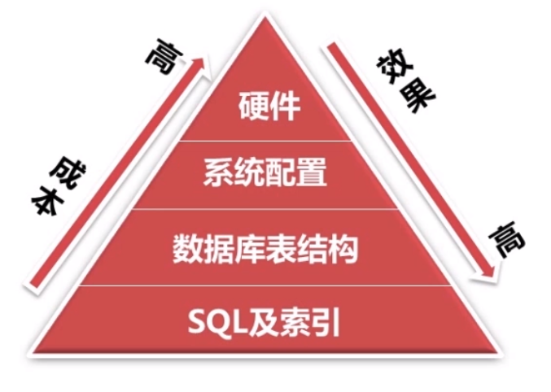

硬件为CPU IO 内存的改善 只能减少阻塞的可能, 成本高且效果不明显

系统配置为TCP/IP允许通过的文件数, 若已打开文件数已经达到了最大值, 无法被开启的新文件就会频繁的进行IO操作, 加大磁盘IO的负担

从数据库表的层次解耦表与表之间的关系

优化SQL与索引为优化数据库最好的最根本的方式

### 如何发现有问题的SQL?

1. 使用MySQL慢查询日志对有效率问题的SQL进行监控

2. ```mysql
   show variables like 'slow_query_log';
   set global slow_query_log_file = '';
   set global log_queries_not_using_indexes = on;
   set global long_query_time = 0;
   ```
   慢查询日志所包含的内容

   

   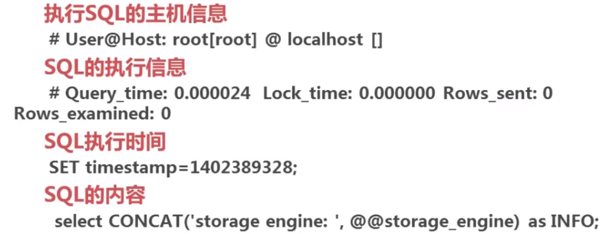


### MySQL慢查询日志分析工具之mysqldumpslow

MySQL自带的日志分析查询工具 mysqldumpslow 

有关的信息较少, 只有SQL语句的运行时间 锁的持有时间 查询得到的行数 还有更好的工具


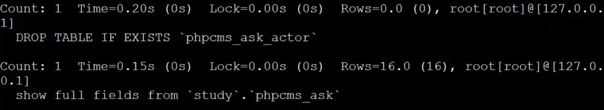

### MySQL慢查日志的分析工具之 pt-query-digest


**纵观分析结果图1**

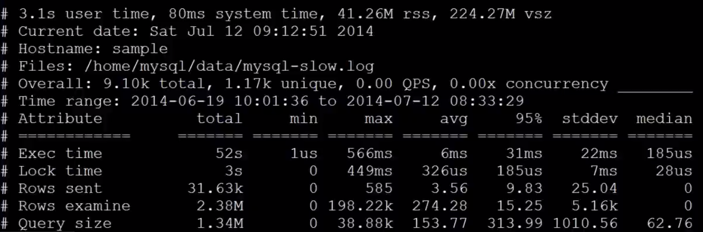

1. 有显示总查询和实际普通查询的数量, 可表示查询的优化程度 


总查询数量和实际普通查询数量为1 : 9 说明把9000个查询抽象成了1000多个查询

2. 针对执行时间 锁的持有时间 总共发送的行数 扫描的行数

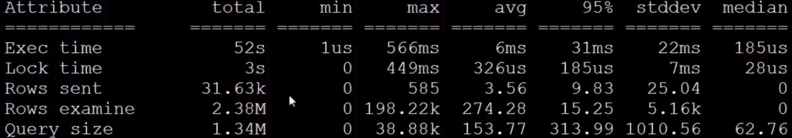

扫描的行数大于发送的行数 说明了表的索引以及SQL语句没有优化好

**纵观分析结果图2**

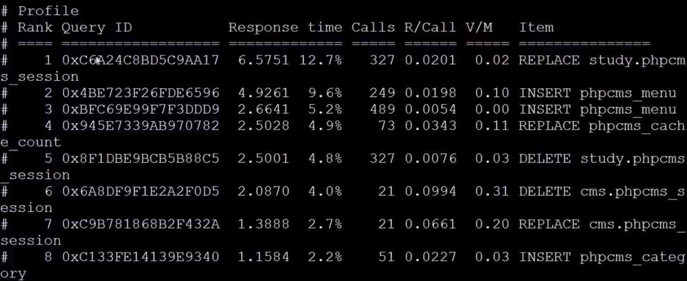

3. 按照表的调用次数和响应时间进行排序, 可明显看到哪个表是被访问的次数是最多的

**纵观分析结果图3**

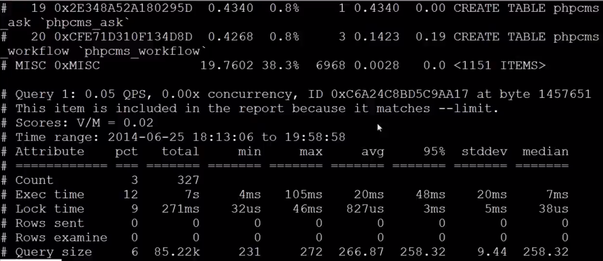

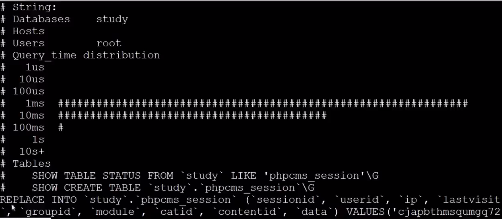

4. 针对指定sql语句的执行次数和锁持有时间 对指定sql语句进行分析


### 如何通过慢查询日志发现有问题的SQL?

1. 查询次数多且每次查询占有时间长的SQL, 通常为pt-query-digest分析的前几个查询
2. IO大的SQL, 注意pt-query-digest分析中的Rows examine项
3. 未命中索引的SQL, 注意pt-query-digest分析中Rows examine 和 Rows Send 的对比

### 通过explain查询和分析SQL的执行计划

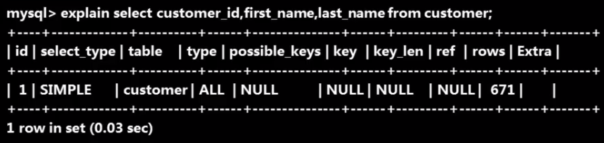

- table 显示这一行的数据是关于哪张表的

- type 这是重要的列, 显示连接使用了何种类型. 从最好的到最差的链接类型为const eq_reg ref range index ALL

- possible_keys 显示可能应用在这张表中的索引, 如果为空, 没有可能的索引

- key 实际使用的索引, 如果为null, 则没有使用索引

- key_len 使用索引的长度, 在不损失精确性的情况下, 长度越短越好

- ref 显示索引的哪一列被使用了, 如果可能的话, 是一个常数

- rows MYSQL认为必须检查的用来返回请求数据的行数

  

### Max()的优化


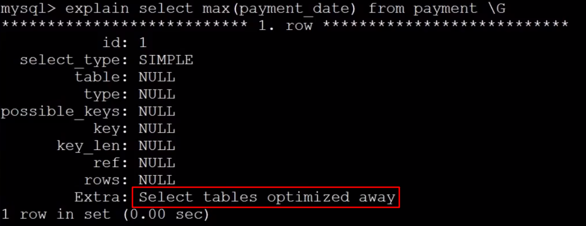

### Count()的优化

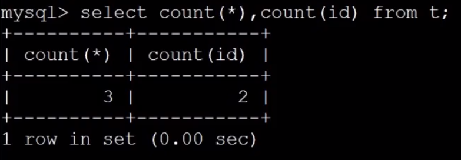

count(*)是包括null的

### 子查询的优化


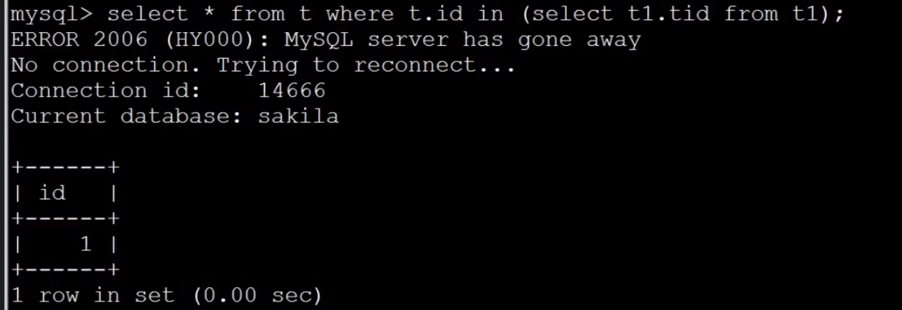

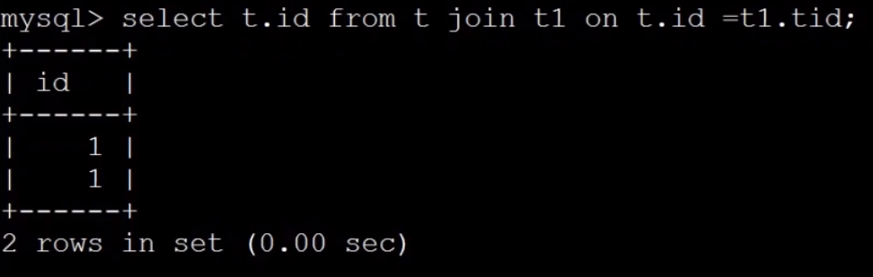


**为什么join查询方式比子查询的方式速度更快呢?**

- 因为join查询不需要内建临时表处理. use temporary


### Group by的优化

优化前


优化后


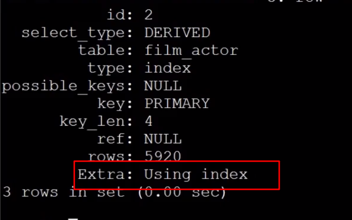

### Limit的优化

优化前


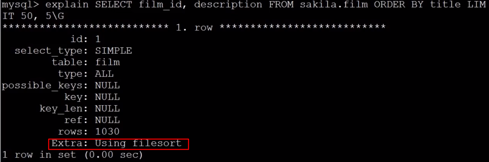

优化后


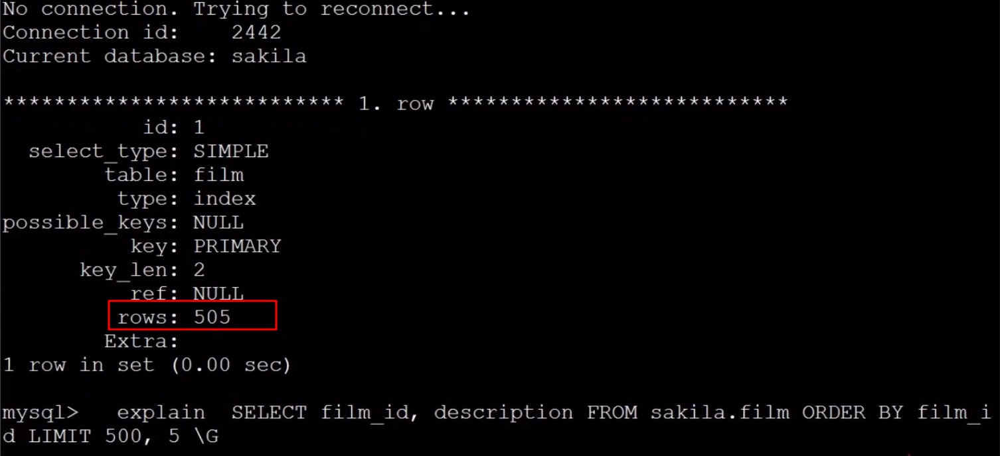

**随着数量的增加 IO增大**

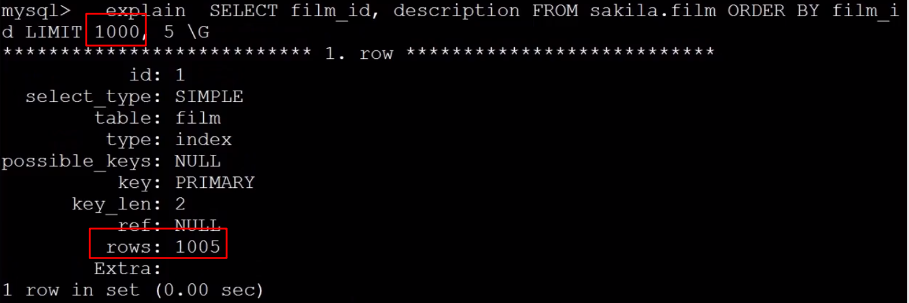


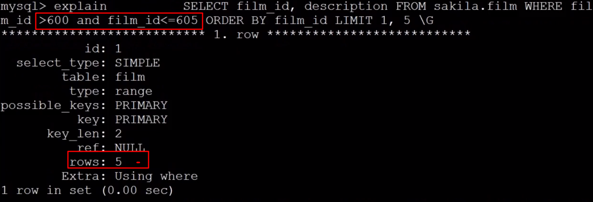

### 如何选择合适的列建立索引?


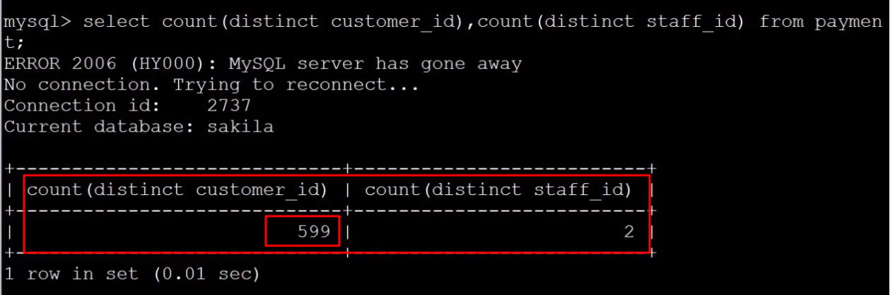

### 索引的维护及优化---重复及冗余索引

索引过多会降低查询和写入的效率 select insert update 因为在查询或写入的时候 MySQL首先会选择使用哪一个索引进行查询 如果索引越多 分析的过程就会越慢 所以所以过多会影响效率

#### 重复索引


#### 冗余索引


#### 如何查找重复及冗余索引

##### 使用sql语句

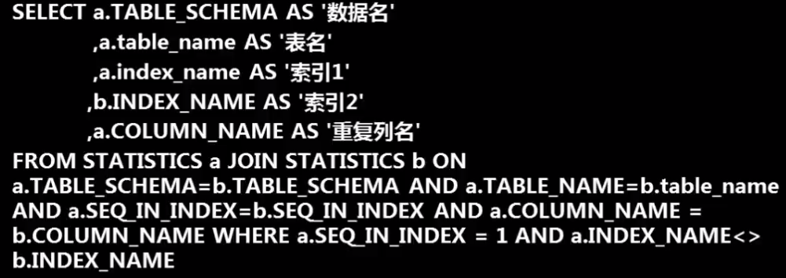

##### 使用pt-duplicate-key-checker


### 索引维护方式


### 选择合适的数据类型


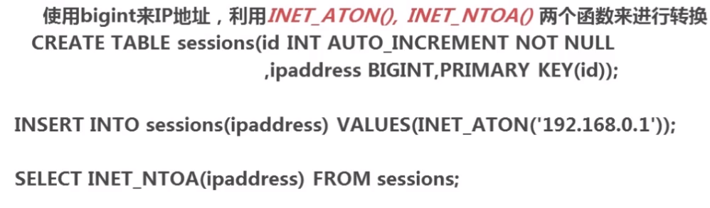

### 数据库表的范式化优化

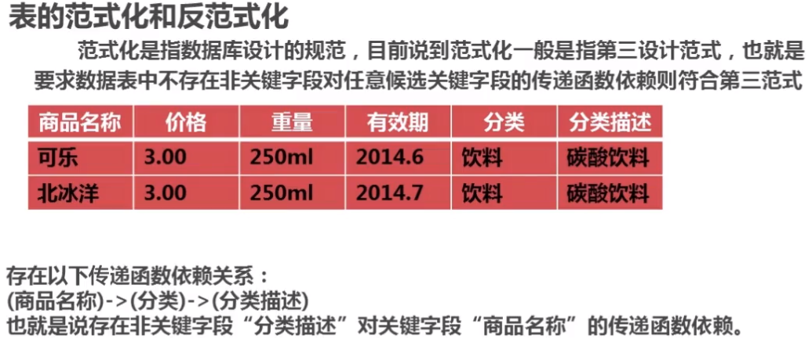

第一范式（1NF）是指数据库表的每一列都是不可分割的基本数据项

第二范式（2NF）要求实体的属性完全依赖于主关键字

第三范式（3NF）：如果关系模式R（U，F）中的所有非主属性对任何候选关键字都不存在传递依赖，则称关系R是属于第三范式的。

[BCNF](https://baike.baidu.com/item/BCNF/9446795)：如果[关系模式](https://baike.baidu.com/item/%E5%85%B3%E7%B3%BB%E6%A8%A1%E5%BC%8F)R（U，F）的所有属性（包括[主属性](https://baike.baidu.com/item/%E4%B8%BB%E5%B1%9E%E6%80%A7/120103)和[非主属性](https://baike.baidu.com/item/%E9%9D%9E%E4%B8%BB%E5%B1%9E%E6%80%A7/3462646)）都不传递依赖于R的任何[候选关键字](https://baike.baidu.com/item/%E5%80%99%E9%80%89%E5%85%B3%E9%94%AE%E5%AD%97/9797654)，那么称关系R是属于BCNF的。或是关系模式R，如果每个决定因素都包含关键字（而不是被关键字所包含），则关系R是RCNF的关系模式。


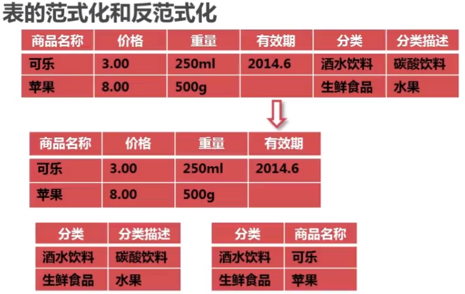

### 数据库的反范式化优化


### 数据库表的垂直拆分


### 数据库表的水平拆分


### 数据库系统配置优化


### MySQL配置文件优化


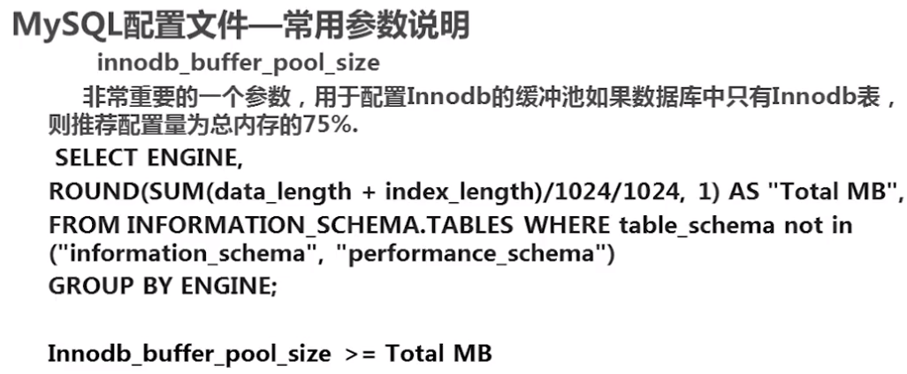


### 第三方配置工具


### 服务器硬件优化


