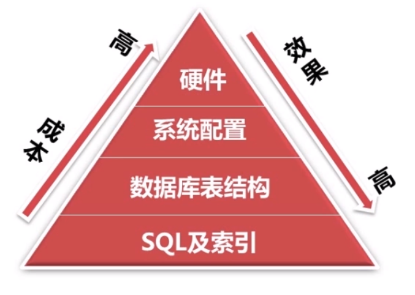

# 数据库优化总结

### 数据库优化的目的

#### 避免出现页面访问错误**

1. 由于数据库链接timeout产生的页面5xx错误
2. 由于**慢查询**造成页面无法加载
3. 由于**阻塞**造成数据无法提交

#### 增加数据库的稳定性**

1. 很多数据库问题都是由于**低效的查询**引起的

**优化用户体验**

1. 流畅页面的访问速度
2. 良好的网站功能体验

### 如何进行数据库优化?

#### 针对SQL语句进行优化

1. 借用相关工具对SQL语句的执行进行检测, 针对查询次数多锁占有时间长的 磁盘IO的内存大的 未命中索引的SQL 进行优化, 找出了对应的SQL语句之后, 借助explain语句查询和分析SQL的执行计划, 针对执行计划进行优化, 通过执行计划的extra列可得到他是否有是由临时表来存储结果, 需要进行额外的步骤对返回的行进行排序, 是否使用了索引, 针对执行计划来对SQL语句进行优化, 没有使用索引的要尽量使用索引

有使用临时表来存储结果的要尽量避免, 子查询有时候就会需要使用临时表来存储结果, 将子查询改成连接查询, 同时要注意连接查询是否存在一对多的关系 可能存在重复数据 需要去重

#### 说到索引

1. 尽量使where order by 后面的条件字段
2. 索引字段越小越好
3. 针对联合索引, 离散度大的列要放在最前面
4. 避免重复索引和冗余索引, 我们同样可以使用相关工具对索引进行一系列的检测, pt系列的工具
5. 删除不需要的索引

#### 数据存储方面, 要选择合适的数据类型

1. 使用可以存下数据的最小数据类型, 例如id用11位能存 就不要开20位来存
2. 尽量使用简单的数据类型 例如int要比varchar类型在mysql处理上简单
3. 尽可能使用not null定义字段 这样MySQL不需要针对每种不同字段额外定义空字段

#### 表的范式化优化

1. 要让表符合第三范式, 不存在传递函数依赖

#### 表的反范式优化

1. 有时候, 需要频繁获取较多的信息需要跨越多个表进行查询, 我们这时候就要让表有冗余数据, 方便查询

#### 表的垂直拆分

1. 把原来一个有很多列的表拆分成多个表, 解决表的宽度问题
   1. 把不常用的字段的单独放到一个表中
   2. 把大字段单独放到一个表中
   3. 把经常一起使用的字段放到一个表中

#### 表的水平拆分

1. 为了解决单表的数据量过大的问题, 水平拆分的表每一个表的结构都是一致的, 例如针对id进行hash运算, 取模5后, 为0的值为一个表, 为1 的值为一个表 为2的值为一个表 等等

#### 数据库系统配置优化

1. linux系统\
   1. tcp支持的队列数量
   2. 打开文件数的最大值限制
2. MySQL
   1. 设置配置文件的一些值 例如连接池的最大数量

#### 服务器硬件优化

1. 加大内存
2. 不是cpu越多越好 有些工作只用到单核cpu
3. 针对io的策略进行优化