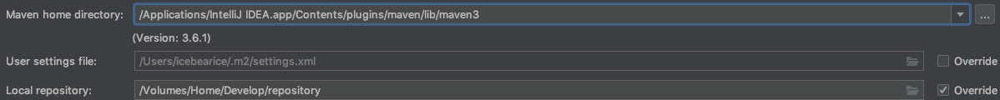
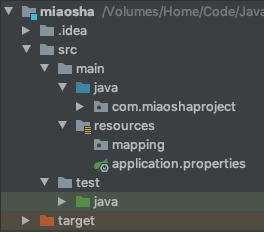
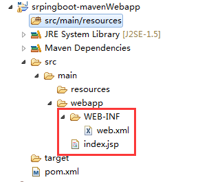



本文为关于练习Java项目写下的相关笔记，涉及到SpringBoot、Tomcat云端部署、线程池优化、分布式Nginx、分布式token扩展、缓存系列Redis、本地缓存、lua缓存、cdn优化、令牌与RocketMQ消息队列实现流量削峰、JMeter压力测试等知识体系，因为是练习项目，笔记内容可能比较混杂，我会遇到问题不断的延伸，所以才有了这么一份总结



### 两种`archetype` `quickstart`和`webapp`的区别

`archetype`是骨架的意思，`maven`为我们开发制定好了一份`项目的原始模版`，我们可以在`原始模版`的`基础`上，进行`扩展`与`延伸`。

maven有提供各种各样的`模版`，这里只讲`quickstart`和`webapp`的区别

1. `maven-archetype-quickstart`
2. `maven-archetype-webapp`

<!-- more -->

`maven`配置路径如下，我用的是自带的`maven3`，仓库和配置文件的位置比较奇葩，请勿模仿，要放就放一个地方：

##### 区别:项目结构不同

`quickstart`的项目结构图

基本内容包括：

1. `一个包含junit的依赖生命的pom.xml`
2. `src/main/java主代码目录及一个名为App的类`
3. `src/test/java测试代码目录及一个名为AppTest的测试用例`

`webapp`的项目结构图

基本内容包括：

1. `一个packaging为war且带有junit依赖声明的pom.xml`
2. `src/main/webapp/目录`
3. `src/main/webapp/index.jsp文件`
4. `src/main/webapp/WEB-INF/web.xml文件`

##### 为什么会有这样的结构的区别呢

其实两个骨架除了文件目录结构上的区别外，区别就是`quickstart`已经将`SpringBoot`的配置文件`application.properties`给创建好了，不需要我们额外的去创建该配置文件，是传统的`webapp`向`SpringBoot`的一个转型，为了`SpringBoot`去制定的一个`Archetype`

quickstart创建的是以jar包的方式，提供一个对外的统一输出

原来的webapp创建的是以war包的方式，部署在Tomcat或者JBoss这种J2EE的这种容器里面

#### Building a RESFul Web Service

1. 引入对应的pom文件的spring start 依赖
   1. Spring-boot-starter-parent 指定父pom
   2. Spring-boot-starter-web 依赖关系如下
      1. maven 支持 jar
      2. logging jar
      3. tomcat jar
      4. web jar
2. groupId和artifactId和version
   1. 请看maven篇
3. emmm 导包过程中 突然想起一道笔试题 
   1. 在import语句上只可以有注释
      1. 还可以有包名 我是猪吧 🐷
   2. 8090端口被ssr占用

